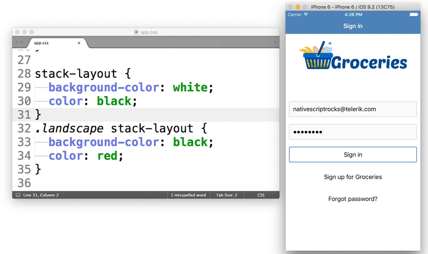

[](https://www.npmjs.com/package/nativescript-orientation)
[](https://www.npmjs.com/package/nativescript-orientation)
[](https://www.npmjs.com/package/nativescript-orientation)
[](https://twitter.com/congocart)

# nativescript-orientation
A NativeScript plugin to deal with Declarative UI and Screen Orientation
This handles both sides of the orientation issues;  both the events on when the orientation changes; and the ability to change the orientation manually.

## Developed by
[](https://plugins.nativescript.rocks/mastertech-nstudio)

## License

This is released under the MIT License, meaning you are free to include this in any type of program -- However for entities that need a support contract, changes, enhancements and/or a commercial license please contact me at [http://nativescript.tools](http://nativescript.tools).

I also do contract work; so if you have a module you want built for NativeScript (or any other software projects) feel free to contact me [nathan@master-technology.com](mailto://nathan@master-technology.com).

[](https://www.paypal.com/cgi-bin/webscr?cmd=_donations&business=HN8DDMWVGBNQL&lc=US&item_name=Nathanael%20Anderson&item_number=nativescript%2dorientation&no_note=1&no_shipping=1&currency_code=USD&bn=PP%2dDonationsBF%3ax%3aNonHosted)
[](https://www.patreon.com/NathanaelA)

## Sample Snapshot

Thanks to TJ VanToll for the awesome animated gif.
 

## Installation 
tns plugin add nativescript-orientation  

#### NativeScript 2.x.x
tns plugin add nativescript-orientation@1.6.1

## Usage

To use the module you just `require()` it:

 
```js
require( "nativescript-orientation" );
```

This plugin has two separate abilities; the first ability is to setup the cool ability to run a function and setup the css when the screen is rotated.
For this ability, you do NOT need to keep a reference to it for the orientation event handling and css.  You only need to load it once.   I recommend you add it to your app.js file and forget about it.
It will automatically attach its methods to all the proper classes in the NativeScript library making it act as if they are built in.
What this does is automatically add and remove the "landscape" to the current **Page**'s cssClass variable (and does other magic behind the scenes allowing it to actually work).  

If you want to manually control the orientation, then you will need to require it and use the functions you need.  


## You ask, how exactly does this help?
Well, guess what Cascading means in CSS?  
Yes, this means this works now: 

#### Plain Awesome NativeScript (PAN)
```css
StackLayout {
  background-color: red;
}

.landscape StackLayout {
  background-color: green;
}
```

#### NativeScript Angular (NAN)
```css
StackLayout {
    background-color : red;
}

/deep/ .landscape StackLayout  {
    background-color: green;
}
```

So in portrait the background would be red, in landscape the color is green.
Please note in Angular, you need to prefix the `.landscape` with `/deep/` for it to work!  


## Why use this?
You can set ALL the normal CSS values this way include width, height, font-size.
By using the css to control any normal items and your own page's exports.orientation to control anything not controllable by css you can change the look completely between Landscape/Portrait.


### You can add to any page you need it the following Function:
#### exports.orientation(args) 
##### args.landscape = true | false
##### args.object = the current page
This function (if it exists) will be ran when the page is first created so you can set any needed defaults. (This is ran at the same time as the PageNavigatingTo event)
This function (if it exists) will be ran each time the orientation changes.
Since at this moment some items can't be controlled by CSS like orientation on ScrollView, this event allows you to control change those things when the orientation changes via your code.

Please note, there is also a built in event in NativeScript called `orientationChanged` event.  The differences between these is that the built in event only gets called when the orientation changes;
This event is called on every screen navigation and any time the device rotates; allowing you to setup any rotation stuff during the creation of the screen.   
** ANGULAR NOTE: The `exports.orientation` function event does NOT work in Angular since Angular does not have the same concept.  **
   


### Additional Helper Method

```js 
var orientation = require('nativescript-orientation');
``` 

#### orientation.getOrientation(sensors?)
##### optional sensor === true, will return you sensor values on android verses screen size calculation
##### Some android tablets lie about port vs landscape; so we determine the orientation based on the current screen sizes
```js
  var orientation = require('nativescript-orientation');
  console.log(orientation.getOrientation());  // Returns the enum DeviceOrientation value
```
 
#### orientation.setOrientation(direction, animation)
##### Direction - "portrait" | "landscape" | "landscapeleft" | "landscaperight" | enum DeviceOrientation
##### Animation === false, disabled animation on iOS.  (iOS ONLY currently)
This will automatically disable rotation support after it changes the orientation.
```js
  var orientation = require('nativescript-orientation');
  orientation.setOrientation("landscape");  
```
  

#### orientation.enableRotation() - enable orientation
This will enable automatic orientation support
```js
  var orientation = require('nativescript-orientation');
  orientation.enableRotation();  // The screen will rotate to whatever the current settings are...
```


#### orientation.disableRotation() - disables orientation
This will disable automatic orientation support and lock it to the current orientation
```js
  var orientation = require('nativescript-orientation');
  orientation.disableRotation(); // The screen will no longer rotate 
```


#### orientation.setFullScreen(value) - true/false


### Contributors
- Ashton Cummings
- Dick Smith
- Dimitar Tachev
- Emiel Beeksma
- Zsolt Racz


### Sponsor

<a target='_blank' rel='nofollow' href='https://app.codesponsor.io/link/HXrmpSuyowGyBLzwEVbqXdDa/NathanaelA/nativescript-orientation'>
  
</a>